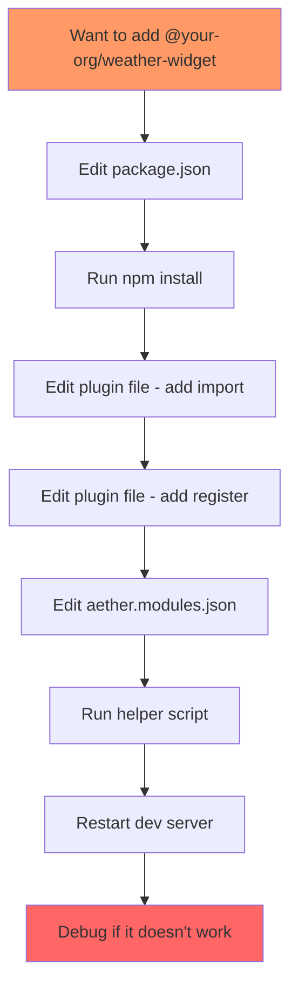
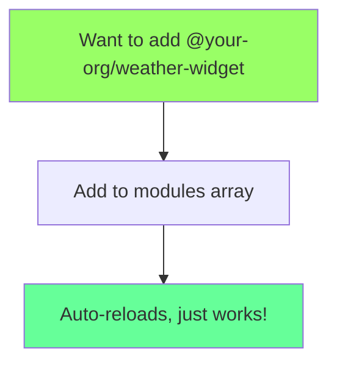

# Nuxt Modules: Visual Comparison

## Adding a New Feature Module

### 🔴 Current Process (4 Files, Multiple Steps)



**Files touched**: 4  
**Chance of error**: High  
**Time**: 10-15 minutes  
**Frustration level**: 😤😤😤

### 🟢 With Nuxt Modules (1 File, 1 Step)



**Files touched**: 1  
**Chance of error**: Nearly zero  
**Time**: 30 seconds  
**Satisfaction level**: 😊😊😊

## Code Comparison

### Current Approach 🔴

```diff
# File 1: package.json
{
  "dependencies": {
    "@your-org/event-sender": "^1.0.0",
+   "@your-org/weather-widget": "^1.0.0"
  }
}

# File 2: plugins/01.module-registry.client.ts
import eventSender from '@your-org/event-sender';
+ import weatherWidget from '@your-org/weather-widget';

// ... later in the file ...

moduleRegistry.register(eventSender);
+ moduleRegistry.register(weatherWidget);

# File 3: public/aether.modules.json
{
  "modules": [
    {
      "name": "@your-org/event-sender",
      "enabled": true
    },
+   {
+     "name": "@your-org/weather-widget",
+     "enabled": true
+   }
  ]
}

# File 4: Your mental state
- "Did I add it in all the right places?"
- "Is the import order correct?"
- "Why isn't it showing up?"
- "Oh, I forgot to restart..."
```

### Nuxt Module Approach 🟢

```diff
# File 1: nuxt.config.ts
export default defineNuxtConfig({
  modules: [
    '@your-org/event-sender',
+   '@your-org/weather-widget'
  ]
})

# That's it. You're done. Go get coffee. ☕
```

## Complex Module Example: Doom

### Current Doom Setup 🔴 (8+ Manual Steps)

```bash
📁 PROJECT ROOT
├── 📝 Step 1: Edit package.json
├── 📝 Step 2: Edit plugins/01.module-registry.client.ts (import)
├── 📝 Step 3: Edit plugins/01.module-registry.client.ts (register)
├── 📝 Step 4: Edit public/aether.modules.json
├── 📂 public/
│   ├── 📦 Step 5: Copy wdosbox.js here
│   ├── 📦 Step 6: Copy wdosbox.wasm here
│   ├── 📂 doom/
│   │   ├── 📦 Step 7: Copy doom-bundle.zip here
│   │   ├── 📦 Step 8: Copy wdosbox.js here (duplicate!)
│   │   └── 📦 Step 9: Copy wdosbox.wasm here (duplicate!)
│   └── 📝 Step 10: Create doom-standalone.html
└── 🤯 Step 11: Debug why it's not working
```

### Nuxt Module Doom 🟢 (1 Step)

```typescript
// nuxt.config.ts
modules: ['@your-org/aether-doom']; // ✨ All files copied automatically
```

## Module Registration Flow

### Current Flow 🔴

```
Developer adds dependency
    ↓ (manual)
Edit import in plugin
    ↓ (manual)
Edit register in plugin
    ↓ (manual)
Edit JSON config
    ↓ (manual)
Module maybe works?
    ↓ (debug)
😭
```

### Nuxt Module Flow 🟢

```
Developer adds to modules array
    ↓ (automatic)
✨ Everything just works ✨
    ↓
😊
```

## Time Investment vs. Savings

```
Current approach (per module):
├── Initial integration: 15 minutes
├── Debugging when it fails: 10-30 minutes
├── Explaining to new dev: 20 minutes
└── Total: ~45 minutes of frustration

Nuxt modules (per module):
├── Add to config: 30 seconds
├── It just works: 0 minutes
├── New dev figures it out: 0 minutes
└── Total: 30 seconds of happiness

ROI Break-even: After adding just 2-3 modules!
```

## Developer Happiness Meter

### Current System

```
Happiness: ▓▓░░░░░░░░ 20%
Frustration: ▓▓▓▓▓▓▓▓░░ 80%
```

### With Nuxt Modules

```
Happiness: ▓▓▓▓▓▓▓▓▓░ 90%
Frustration: ▓░░░░░░░░░ 10%
```

---

_"Simplicity is the ultimate sophistication."_ - Leonardo da Vinci
